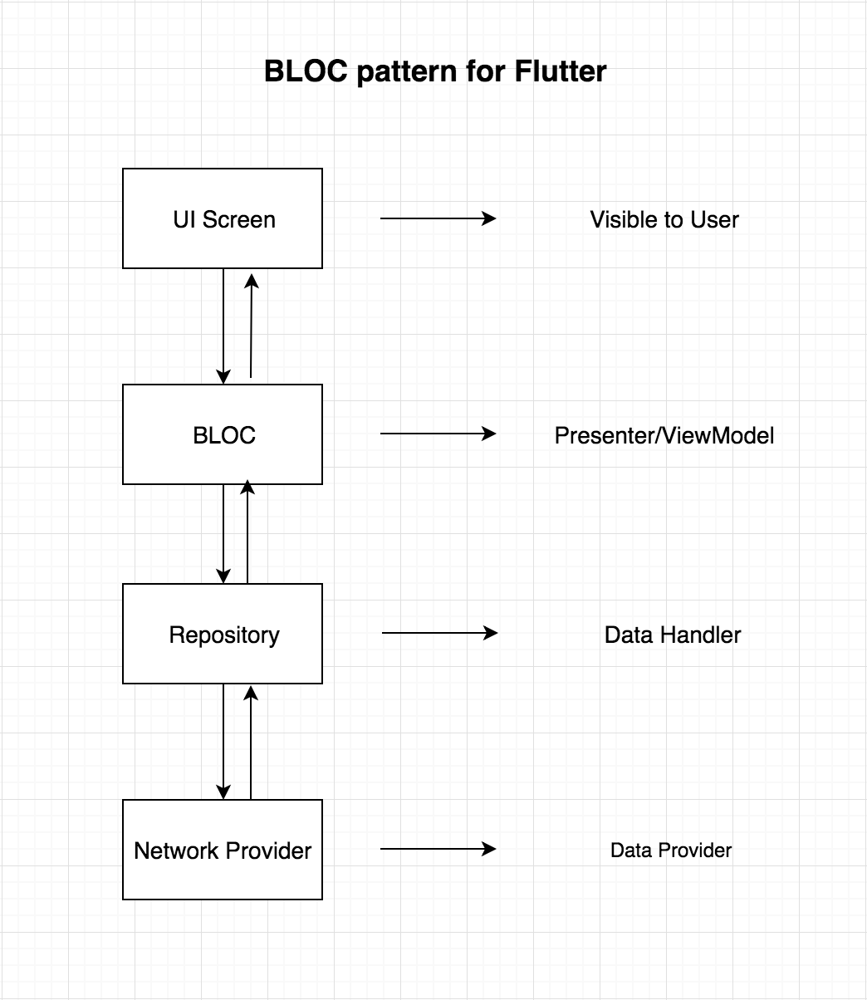
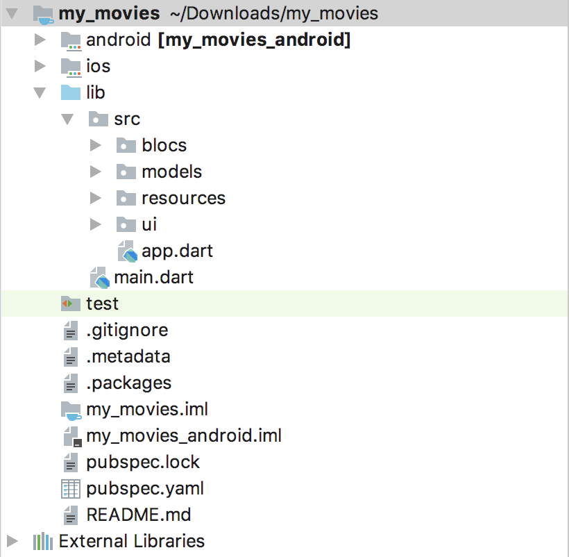

#   Architect flutter projects using the BLOC pattern

Here is a visual experience of the architecture we will be following to 
structure this app.



The above diagram shows how the data flow from UI to the Data layer and 
vice versa. BLOC will never have any reference of the Widgets in the 
UI Screen. The UI screen will only observe changes coming from BLOC 
class.

### What is BLOC Pattern?
It's a state management system for Flutter recommended by Google developers. 
It helps in managing state and make access to data from a central place in 
your project.

### Can I co-relate this architecture with any other architectures out there?
Yes of course. **MVP** and **MVVM** are some good examples. The Only thing that 
changes, is: **BLOC will be replaced with ViewModel in MVVM**.

### What is under the hood of BLOC ? or What is that core thing that manages the state in one place?
STREAMS or REACTIVE approach. In general terms, data will be flowing from the 
BLOC to the UI or from UI to the BLOC in the form of streams. 

>Write down the below code in your main.dart file:
import 'package:flutter/material.dart';
import 'src/app.dart';

`void main(){
  runApp(App());
}`

>Create a src package under the lib package. Inside src package create a 
>file and name it as app.dart. Copy paste the below code inside the app.dart 
>file.

import 'package:flutter/material.dart';
import 'ui/movie_list.dart';

`class App extends StatelessWidget {
  @override
  Widget build(BuildContext context) {
    // TODO: implement build
    return MaterialApp(
        theme: ThemeData.dark(),
        home: Scaffold(
          body: MovieList(),
        ),
      );
  }
}`

>Create a new package inside the src package and name it as resources.

Now create few new packages i.e **blocs**, **models**, **resources** 
and **ui** as shown in the below diagram and then we are set with the 
skeleton of the project:



blocs package will hold our BLOC implementation related files. models 
package will hold the POJO class or the model class of the JSON response 
we will be getting from the server. Resources package will hold the repository 
class and the network call implemented class. ui package will hold our screens 
that will be visible to the user.

>we have to add the RxDart third party library. 

Dart comes with a very decent Streams API out-of-the-box; rather than attempting 
to provide an alternative to this API, **RxDart** adds functionality from the 
reactive extensions specification on top of it.

> along with http: ^0.13.3

This package contains a set of high-level functions and classes that make it easy 
to consume HTTP resources. It's multi-platform, and supports mobile, desktop, 
and the browser.

We have now completed the skeleton of the project. Time to deal with the most 
bottom layer of the project i.e the network layer. Let’s understand the API 
end point which we are going to consume.

---

[hitting this url, get the below response](https://medium.com/codechai/architecting-your-flutter-project-bd04e144a8f1)

`{
  "page": 1,
  "total_results": 19772,
  "total_pages": 989,
  "results": [
    {
      "vote_count": 6503,
      "id": 299536,
      "video": false,
      "vote_average": 8.3,
      "title": "Avengers: Infinity War",
      "popularity": 350.154,
      "poster_path": "\/7WsyChQLEftFiDOVTGkv3hFpyyt.jpg",
      "original_language": "en",
      "original_title": "Avengers: Infinity War",
      "genre_ids": [
        12,
        878,
        14,
        28
      ],
      "backdrop_path": "\/bOGkgRGdhrBYJSLpXaxhXVstddV.jpg",
      "adult": false,
      "overview": "As the Avengers and their allies have continued to protect the world from threats too large for any one hero to handle, a new danger has emerged from the cosmic shadows: Thanos. A despot of intergalactic infamy, his goal is to collect all six Infinity Stones, artifacts of unimaginable power, and use them to inflict his twisted will on all of reality. Everything the Avengers have fought for has led up to this moment - the fate of Earth and existence itself has never been more uncertain.",
      "release_date": "2018-04-25"
    },`

Let’s build a model or POJO class for this type of response. Create a new file 
inside the models package and name it as item_model.dart. Copy and paste the 
below code inside item_model.dart file:

>[JSON to Dart](https://javiercbk.github.io/json_to_dart/)

See lib/models/item_model.dart for implementation

---

>  Now its time to work on the network implementation. 

Create a file inside the resources package and name it as 
**movie_api_provider.dart**.  Copy and paste the below code inside the 
file:
```
import 'dart:async';
import 'package:http/http.dart' as http;
import 'dart:convert';
import '../models/item_model.dart';

class MovieApiProvider {
  final _apiKey = 'your-api-key';

  Future<ItemModel> fetchMovieList() async {
    print("entered");
    final response = await http.get(
        Uri.https('https://image.tmdb.org/t/p/w500',
            '/3/movie/popular',
            {'api_key' : {_apiKey}}),
        headers: {
          'Content-Type': 'application/json; charset=UTF-8',
        });
    print(response.body.toString());
    if (response.statusCode == 200) {
      // If the call to the server was successful, parse the JSON
      return ItemModel.fromJson(json.decode(response.body));
    } else {
      // If that call was not successful, throw an error.
      throw Exception('Failed to load post');
    }
  }
}
```

**fetchMovieList()** is making the network call to the API. Once the network 
call is complete it’s returning a Future ItemModel object if the network call 
was successful or it will throw an Exception.

---

> We're now ready for our repository
 
Inside the resources package create a fil name repository.dart. Copy and paste 
the below code inside the file:

```
import 'dart:async';
import 'movie_api_provider.dart';
import '../models/item_model.dart';

class Repository {
  final moviesApiProvider = MovieApiProvider();

  Future<ItemModel> fetchAllMovies() => moviesApiProvider.fetchMovieList();
}

```

We are importing the *movie_api_provider.dart* file and calling it's 
**fetchMovieList()** method. <u>**This Repository class is the central point from 
where the data will flow to the BLOC.**</u>

---

>Implementing the bloc logic.

Create a new file inside the blocs package and name it as **movies_bloc.dart.** 
Copy paste below code:

```
import '../resources/repository.dart';
import 'package:rxdart/rxdart.dart';
import '../models/item_model.dart';

class MoviesBloc {
  final _repository = Repository();
  final _moviesFetcher = PublishSubject<ItemModel>();

  Future<Stream<ItemModel>> get allMovies async => _moviesFetcher.stream;
  //  not async version of the above
  //Stream<ItemModel> get allMovies => _moviesFetcher.stream;

  //  The below is deprecated
  //Observable<ItemModel> get allMovies => _moviesFetcher.stream;

  fetchAllMovies() async {
    ItemModel itemModel = await _repository.fetchAllMovies();
    _moviesFetcher.sink.add(itemModel);
  }

  dispose() {
    _moviesFetcher.close();
  }
}

final bloc = MoviesBloc();

```

We're using the package **‘package:rxdart/rxdart.dart’**   which adds 
additional capabilities to Dart **Streams** and **StreamControllers**.

Dart comes with a very decent Streams API out-of-the-box; rather than attempting 
to provide an alternative to this API, RxDart adds functionality from the 
reactive extensions specification on top of it. 

For more see: https://pub.dev/packages/rxdart

We create a Repository class object for access to the fetchAllMovies().  Next,
a **PublishSubject** object is created, whose responsibility it is to add the data 
which it gets from the server in the form of a **ItemModel** object, and passes it 
to the UI screen as a stream. [PublishSubject<T> class](https://pub.dev/documentation/rxdart/latest/rx/PublishSubject-class.html)

To pass the **ItemModel** object as stream we have to create another method: 
*allMovies()*, whose return type is Observable.

On the last line we are creating the bloc object. Doing this, gives access to a 
single instance of the MoviesBloc class to the UI screen.

For more information on reactive programming see the below notes.  In a nutshell:
*Whenever there is new data from the server; we need to update the UI screen. 
To make this updating task simple, we need the UI screen to keep observing any 
changes coming from the **MoviesBloc** class, and accordingly update our content. 
This “observing" of new data can be done using **RxDart**.*

---

> Now for the UI

Create a new file inside the ui package and name it as movie_list.dart. Copy 
paste the below code:

```
import 'package:flutter/material.dart';
import '../models/item_model.dart';
import '../blocs/movies_bloc.dart';

class MovieList extends StatelessWidget {
  @override
  Widget build(BuildContext context) {
    bloc.fetchAllMovies();
    return Scaffold(
      appBar: AppBar(
        title: Text('Popular Movies'),
      ),
      body: StreamBuilder(
        stream: bloc.allMovies,
        builder: (context, AsyncSnapshot<ItemModel> snapshot) {
          if (snapshot.hasData) {
            return buildList(snapshot);
          } else if (snapshot.hasError) {
            return Text(snapshot.error.toString());
          }
          return Center(child: CircularProgressIndicator());
        },
      ),
    );
  }

  Widget buildList(AsyncSnapshot<ItemModel> snapshot) {
    return GridView.builder(
        itemCount: snapshot.data.results.length,
        gridDelegate:
        new SliverGridDelegateWithFixedCrossAxisCount(crossAxisCount: 2),
        itemBuilder: (BuildContext context, int index) {
          return Image.network(
            'https://image.tmdb.org/t/p/w185${snapshot.data
                .results[index].posterPath}',
            fit: BoxFit.cover,
          );
        });
  }
}

```

>## Best and interesting part of this class is, we're not using a 
>**StatefulWidget**. But instead, a StreamBuilder which will do the same job 
>that a StatefulWidget does i.e updating the UI.

One thing to point out here is that we are making a network call inside Widget build(): 
 
 ```
  Widget build(BuildContext context) {
    bloc.fetchAllMovies();
    ...
    ...
    code removed for brevity
    ...
    ...
  }

```
 This should not be done, as the the build method can be called multiple times.  We
 will revisit this later on.
 
 As previously noted, our MoviesBloc class is passing the new data as a stream. To
 accommodate this we make use of **StreamBuilder** which will listen to the incoming 
 streams and update the UI accordingly:
 
 ````
        body: StreamBuilder(
         stream: bloc.allMovies,
         builder: (context, AsyncSnapshot<ItemModel> snapshot) {
           if (snapshot.hasData) {
             return buildList(snapshot);
           } else if (snapshot.hasError) {
             return Text(snapshot.error.toString());
           }
           return Center(child: CircularProgressIndicator());
         },
       ),

````

StreamBuilder expects a stream parameter where we pass the MovieBloc’s allMovies() 
which in turn returns a stream.

The moment there is a stream of data, StreamBuilder will re-render the widget with the latest data. 
snapshot data holds the ItemModel object.  We used a **GridView** to display all the posters that 
are in the results list of ItemModel object. 

---

## Notes
[doc source](https://medium.com/codechai/architecting-your-flutter-project-bd04e144a8f1)
[The Only Introduction to Reactive Programming You Need](https://dzone.com/articles/only-introduction-reactive)