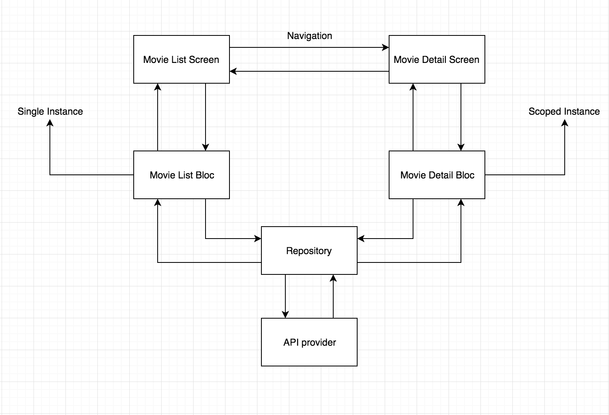
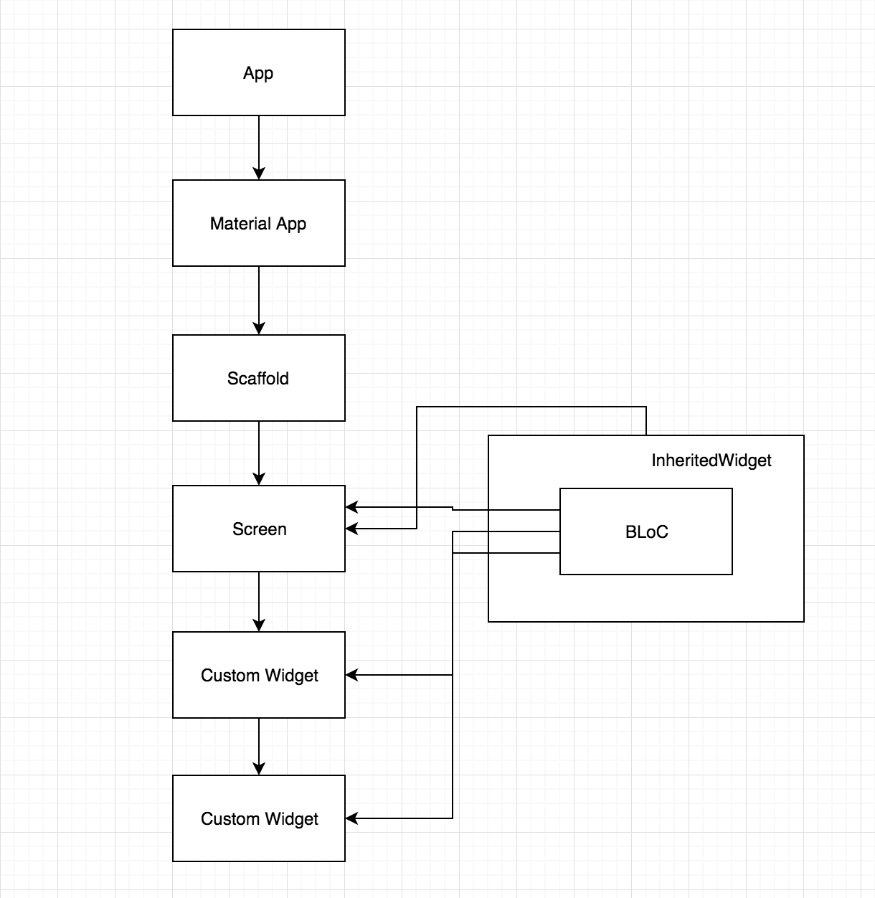
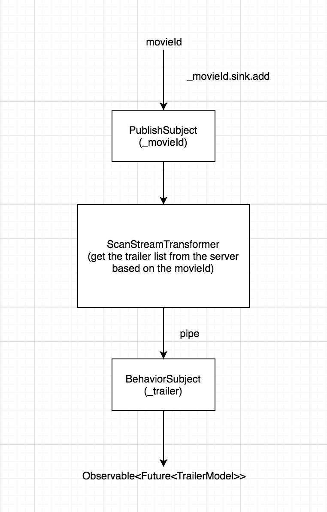

#   Architect flutter projects using the BLOC pattern

Here is a visual experience of the architecture we will be following to 
structure this app.


The above diagram shows how the data flow from UI to the Data layer and 
vice versa. `BLOC` will never have any reference of the Widgets in the 
UI Screen. The UI screen will only observe changes coming from BLOC 
class.

##  What is BLOC Pattern?
It's a state management system for Flutter recommended by Google developers. 
It helps in managing state and make access to data from a central place in 
your project.

## Can we relate this architecture with any other architectures out there?
Yes of course. **MVP** and **MVVM** are some good examples. The Only thing that 
changes, is: **BLOC will be replaced with ViewModel in MVVM**.

## What is under the hood of BLOC ? or What is that core thing that manages the state in one place?
STREAMS or REACTIVE approach. In general terms, data will be flowing from the 
BLOC to the UI or from UI to the BLOC in the form of streams. 

#### Add the following code to main.dart:
```
import 'package:flutter/material.dart';
import 'src/app.dart';

`void main(){
  runApp(App());
}

```

#### Create a src package under the lib package. 
Inside this src folder add *app.dart* and copy the following:

```
import 'package:flutter/material.dart';
import 'ui/movie_list.dart';

`class App extends StatelessWidget {
  @override
  Widget build(BuildContext context) {
    // TODO: implement build
    return MaterialApp(
        theme: ThemeData.dark(),
        home: Scaffold(
          body: MovieList(),
        ),
      );
  }
}`

```

####  Create some additional packages inside the src folder:
1. blocs
2. models
3. resources
4. ui
 
Our folder structure should now look like the diagram below:


**blocs** package will hold our BLOC implementation related files. **models** 
package will hold the POJO class or the model class of the JSON response 
we will be getting from the server. **Resources** package will hold the repository 
class and the network call implemented class. **ui** package will hold our screens 
that will be visible to the user.

#### We have to add the RxDart library. 

Dart comes with a very decent Streams API out-of-the-box; rather than attempting 
to provide an alternative to this API, [RxDart](https://pub.dev/packages/rxdart)  
adds functionality from the reactive extensions specification on top of it.

Additionally we need to add the following dependency:


``http: ^0.13.3``

This package contains a set of high-level functions and classes that make it easy 
to consume HTTP resources. It's multi-platform, and supports mobile, desktop, 
and the browser.

We have now completed the skeleton of the project. It's now time to deal with the most 
bottom layer of the project i.e the network layer. Let’s understand the API 
end point which we are going to consume.

---
## Network layer

hitting our request url returns the below response:
```
{
  "page": 1,
  "total_results": 19772,
  "total_pages": 989,
  "results": [
    {
      "vote_count": 6503,
      "id": 299536,
      "video": false,
      "vote_average": 8.3,
      "title": "Avengers: Infinity War",
      "popularity": 350.154,
      "poster_path": "\/7WsyChQLEftFiDOVTGkv3hFpyyt.jpg",
      "original_language": "en",
      "original_title": "Avengers: Infinity War",
      "genre_ids": [
        12,
        878,
        14,
        28
      ],
      "backdrop_path": "\/bOGkgRGdhrBYJSLpXaxhXVstddV.jpg",
      "adult": false,
      "overview": "As the Avengers and their allies have continued to protect the world from threats too large for any one hero to handle, a new danger has emerged from the cosmic shadows: Thanos. A despot of intergalactic infamy, his goal is to collect all six Infinity Stones, artifacts of unimaginable power, and use them to inflict his twisted will on all of reality. Everything the Avengers have fought for has led up to this moment - the fate of Earth and existence itself has never been more uncertain.",
      "release_date": "2018-04-25"
    },

```    
    

Let’s build a model or POJO class for this type of response. Create a new file 
inside the models package and name it as item_model.dart. Copy and paste the 
below code inside item_model.dart file:

```[JSON to Dart](https://javiercbk.github.io/json_to_dart/)``

See `lib/models/item_model.dart` for implementation

Create a file inside the resources package and named **movie_api_provider.dart**.  Copy and 
paste the below code inside the file:

```
import 'dart:async';
import 'package:http/http.dart' as http;
import 'dart:convert';
import '../models/item_model.dart';

class MovieApiProvider {
  final _apiKey = 'your-api-key';

  Future<ItemModel> fetchMovieList() async {
    print("entered");
    final response = await http.get(
        Uri.https('https://image.tmdb.org/t/p/w500',
            '/3/movie/popular',
            {'api_key' : {_apiKey}}),
        headers: {
          'Content-Type': 'application/json; charset=UTF-8',
        });
    print(response.body.toString());
    if (response.statusCode == 200) {
      // If the call to the server was successful, parse the JSON
      return ItemModel.fromJson(json.decode(response.body));
    } else {
      // If that call was not successful, throw an error.
      throw Exception('Failed to load post');
    }
  }
}
```

`fetchMovieList()` is making the network call to the API. Once the network 
call is complete it’s returning a Future ItemModel object if the network call 
was successful or it will throw an Exception.

---

##  Repository

> We're now ready for our repository
 
Inside the resources package create a file name **repository.dart**. Copy and paste 
the below code inside the file:

```
import 'dart:async';
import 'movie_api_provider.dart';
import '../models/item_model.dart';

class Repository {
  final moviesApiProvider = MovieApiProvider();

  Future<ItemModel> fetchAllMovies() => moviesApiProvider.fetchMovieList();
}

```

We are importing the `movie_api_provider.dart` file and calling it's 
`fetchMovieList()` method. <u>**This Repository class is the central point from 
where the data will flow to the BLOC.**</u>

---

##  Implementing the bloc logic.

Create a new file inside the blocs package and name it as `movies_bloc.dart`. 
Copy paste below code:

```
import '../resources/repository.dart';
import 'package:rxdart/rxdart.dart';
import '../models/item_model.dart';

class MoviesBloc {
  final _repository = Repository();
  final _moviesFetcher = PublishSubject<ItemModel>();

  Future<Stream<ItemModel>> get allMovies async => _moviesFetcher.stream;
  //  not async version of the above
  //Stream<ItemModel> get allMovies => _moviesFetcher.stream;

  //  The below is deprecated
  //Observable<ItemModel> get allMovies => _moviesFetcher.stream;

  fetchAllMovies() async {
    ItemModel itemModel = await _repository.fetchAllMovies();
    _moviesFetcher.sink.add(itemModel);
  }

  dispose() {
    _moviesFetcher.close();
  }
}

final bloc = MoviesBloc();

```

We're using the package `package:rxdart/rxdart.dart`  which adds 
additional capabilities to Dart **Streams** and **StreamControllers**.

Dart comes with a very decent Streams API out-of-the-box; rather than attempting 
to provide an alternative to this API, RxDart adds functionality from the 
reactive extensions specification on top of it. 

For more see: https://pub.dev/packages/rxdart

We create a Repository class object for access to the `fetchAllMovies()`.  Next,
a **PublishSubject** object is created, whose responsibility it is to add the data 
which it gets from the server in the form of a **ItemModel** object, and passes it 
to the UI screen as a stream. [PublishSubject<T> class](https://pub.dev/documentation/rxdart/latest/rx/PublishSubject-class.html)

To pass the **ItemModel** object as stream we have to create another method: 
*allMovies()*, whose return type is Observable.

On the last line we are creating the bloc object. Doing this, gives access to a 
single instance of the MoviesBloc class to the UI screen.

For more information on reactive programming see the below notes.  In a nutshell:
*Whenever there is new data from the server; we need to update the UI screen. 
To make this updating task simple, we need the UI screen to keep observing any 
changes coming from the **MoviesBloc** class, and accordingly update our content. 
This “observing" of new data can be done using **RxDart**.*

---

##  UI Layer

Create a new file inside the ui package and name it as `movie_list.dart`. Copy 
paste the below code:

```
import 'package:flutter/material.dart';
import '../models/item_model.dart';
import '../blocs/movies_bloc.dart';

class MovieList extends StatelessWidget {
  @override
  Widget build(BuildContext context) {
    bloc.fetchAllMovies();
    return Scaffold(
      appBar: AppBar(
        title: Text('Popular Movies'),
      ),
      body: StreamBuilder(
        stream: bloc.allMovies,
        builder: (context, AsyncSnapshot<ItemModel> snapshot) {
          if (snapshot.hasData) {
            return buildList(snapshot);
          } else if (snapshot.hasError) {
            return Text(snapshot.error.toString());
          }
          return Center(child: CircularProgressIndicator());
        },
      ),
    );
  }

  Widget buildList(AsyncSnapshot<ItemModel> snapshot) {
    return GridView.builder(
        itemCount: snapshot.data.results.length,
        gridDelegate:
        new SliverGridDelegateWithFixedCrossAxisCount(crossAxisCount: 2),
        itemBuilder: (BuildContext context, int index) {
          return Image.network(
            'https://image.tmdb.org/t/p/w185${snapshot.data
                .results[index].posterPath}',
            fit: BoxFit.cover,
          );
        });
  }
}

```

> Of Interest here, is that we're not using a `StatefulWidget`. But instead, a `StreamBuilder`
> which will do the same job that a `StatefulWidget` does i.e updating the UI.

*One thing to point out here is that we are making a network call inside Widget build():* 
 
 ```
  Widget build(BuildContext context) {
    bloc.fetchAllMovies();
    ...
    ...
    code removed for brevity
    ...
    ...
  }

```
 **This should not be done, as the the build method can be called multiple times.  We
 will revisit this later on.**
 
 As previously noted, our MoviesBloc class is passing the new data as a stream. To
 accommodate this we make use of `StreamBuilder` which will listen to the incoming 
 streams and update the UI accordingly:
 
 ````
        body: StreamBuilder(
         stream: bloc.allMovies,
         builder: (context, AsyncSnapshot<ItemModel> snapshot) {
           if (snapshot.hasData) {
             return buildList(snapshot);
           } else if (snapshot.hasError) {
             return Text(snapshot.error.toString());
           }
           return Center(child: CircularProgressIndicator());
         },
       ),

````

StreamBuilder expects a stream parameter where we pass the MovieBloc’s allMovies() 
which in turn returns a stream.

The moment there is a stream of data, StreamBuilder will re-render the widget with the latest data. 
snapshot data holds the ItemModel object.  We used a **GridView** to display all the posters that 
are in the results list of ItemModel object. 

---
##  Code refactoring

We will be addressing some of the flaws in the current architectural design and add some additional 
features to the application.

**Four issues we will be addressing in this refactoring are:**
1. Solving the flaws in current architecture design
2. Single Instance vs Scoped Instance (BLoC access)
3. Navigation
4. RxDart’s Transformers

One of the first flaws is the addition of `dispose()*` inside the `MoviesBloc.dart` class. This 
method is responsible disposing all the streams which are open to avoid memory leaks. This method 
has been created; however it's never called. This would be guaranteed to cause  a memory leak.

Another major flaw is that we're making network calls inside the build method which is bad code 
design.  The build method can be called several times and as a result, this network call will 
*fire* everytime. Let’s remedy these two flaws.

As our `MovieList` class is a `StatelessWidget`.  `Widget build(BuildContext context)` will be 
called whenever it is added to the Widget tree and all its properties are `immutable`.

We can make use of  [initState](https://api.flutter.dev/flutter/widgets/State/initState.html) and 
[dispose](https://api.flutter.dev/flutter/widgets/State/dispose.html) in a **StatelessWidget** 
which is provided by Flutter.

`initState` is called when this object is inserted into the tree.  The framework will call this 
method exactly once for each State object it creates. `dispose` Called when this object is removed 
from the tree permanently.  The framework calls this method when this State object will never 
build again.

let’s convert our `MovieList` class from a `StatelessWidget` to a `StatefulWidget` and make the 
network call inside `initState()` and MovieBloc’s `dispose()` inside the StatefulWidget’s 
`dispose().`

>Keypoint: Never make any network or db call inside the `build` method,
>also, always make sure you dispose / close any open streams.

---

## Details screen

It is always a best practice to decide the app flow before adding additional features to your 
application.  We can sketch the additional features we want to use, by using something simple
as a pen and paper.  With that in mind, here is the initial outline of our new features:



Let's explain the more salient points of the above diagram.

1.  **Movie List Screen**: This is the startup screen which list all of the movies.
2.  **Movie List Bloc**: This is the bridge between the data and the repository, using
    singleton design pattern.(see below notes)
3.  **Movie Detail Screen:** This is the screen displays the selected movie details from the
    movie list screen 
4.  **Repository:** This is the central point from where the data flow is controlled.
5.  **API provider:** Our network calls implementation.

##  Single instance and Scope instance

As you can see in the diagram both the screens have access to their respective BLoC class.  We can
expose access the BLoC classes to their respective screens in two ways:
 -  Single Instance
 -  Scoped Instance.
 
 In the case of a single instance or **Singleton**, a single reference of the BLoC class will be 
 exposed to the screen. This type of BLoC class can be accessed from any part of the application. 
 Any screen can use a Single Instance BLoC class.
 
 With **Scoped**, BLoC class has limited access.  In essence, it's only accessible to the screen
 it's associated with or exposed to.  Here is a small diagram to explain it:
 
 
 
 As we can see in the above diagram the bloc is only accessible to the screen widget and 2 
 additional custom widgets below the Screen. We are using the 
 [InheritedWidget](https://api.flutter.dev/flutter/widgets/InheritedWidget-class.html) which will 
 hold the BLoC inside it.  `InheritedWidget` is a base class for widgets that efficiently propagate 
 information down the tree.  No parent widgets of the Screen Widget will have access to the BLoC.
 
 It is important to understand the difference between a Single Instance and Scoped Instance. *Single 
 Instance way of accessing BLoC is useful when you are working on a small app. But if you are 
 working on a big project then Scoped Instance is the preferred way.*
 
 The logic behind the Detail Screen is that when a user clicks on a movie item from the list of 
 movies, the app will navigate to detailed screen where the user can see the details of the movie. 
 Some of the details(movie name, rating, release date, description, poster) will be passed from the 
 list screen to the detail screen.  The trailer will also be loaded from the server if available. 
 For now, let’s focus on showing the main data, and deal with the trailer part later.
 
 add the `movie_detail.dart` inside the ui package and add the following code:
 
 ```
 import 'package:flutter/material.dart';
 
 class MovieDetail extends StatefulWidget {
   final posterUrl;
   final description;
   final releaseDate;
   final String title;
   final String voteAverage;
   final int movieId;
 
   MovieDetail({
     this.title,
     this.posterUrl,
     this.description,
     this.releaseDate,
     this.voteAverage,
     this.movieId,
   });
 
   @override
   State<StatefulWidget> createState() {
     return MovieDetailState(
       title: title,
       posterUrl: posterUrl,
       description: description,
       releaseDate: releaseDate,
       voteAverage: voteAverage,
       movieId: movieId,
     );
   }
 }
 
 class MovieDetailState extends State<MovieDetail> {
   final posterUrl;
   final description;
   final releaseDate;
   final String title;
   final String voteAverage;
   final int movieId;
 
   MovieDetailState({
     this.title,
     this.posterUrl,
     this.description,
     this.releaseDate,
     this.voteAverage,
     this.movieId,
   });
 
   @override
   Widget build(BuildContext context) {
     return Scaffold(
       body: SafeArea(
         top: false,
         bottom: false,
         child: NestedScrollView(
           headerSliverBuilder: (BuildContext context, bool innerBoxIsScrolled) {
             return <Widget>[
               SliverAppBar(
                 expandedHeight: 200.0,
                 floating: false,
                 pinned: true,
                 elevation: 0.0,
                 flexibleSpace: FlexibleSpaceBar(
                     background: Image.network(
                   "https://image.tmdb.org/t/p/w500$posterUrl",
                   fit: BoxFit.cover,
                 )),
               ),
             ];
           },
           body: Padding(
             padding: const EdgeInsets.all(10.0),
             child: Column(
               crossAxisAlignment: CrossAxisAlignment.start,
               children: <Widget>[
                 Container(margin: EdgeInsets.only(top: 5.0)),
                 Text(
                   title,
                   style: TextStyle(
                     fontSize: 25.0,
                     fontWeight: FontWeight.bold,
                   ),
                 ),
                 Container(margin: EdgeInsets.only(top: 8.0, bottom: 8.0)),
                 Row(
                   children: <Widget>[
                     Icon(
                       Icons.favorite,
                       color: Colors.red,
                     ),
                     Container(
                       margin: EdgeInsets.only(left: 1.0, right: 1.0),
                     ),
                     Text(
                       voteAverage,
                       style: TextStyle(
                         fontSize: 18.0,
                       ),
                     ),
                     Container(
                       margin: EdgeInsets.only(left: 10.0, right: 10.0),
                     ),
                     Text(
                       releaseDate,
                       style: TextStyle(
                         fontSize: 18.0,
                       ),
                     ),
                   ],
                 ),
                 Container(margin: EdgeInsets.only(top: 8.0, bottom: 8.0)),
                 Text(description),
               ],
             ),
           ),
         ),
       ),
     );
   }
 }
 
``` 

Note the use of the [createState](https://api.flutter.dev/flutter/widgets/StatefulWidget/createState.html) 
which creates the mutable state for this widget at a given location in the tree.

#### Navigation

In Flutter screen navigation is managed by [Navigator](https://api.flutter.dev/flutter/widgets/Navigator-class.html). 
Inside `movie_list.dart` let’s implement the navigation logic.

The general idea here is, we want to invoke the `Navigator class` by calling the [GestureDetector class](https://api.flutter.dev/flutter/widgets/GestureDetector-class.html)
`onTap` callback.  If we examine the `openDetailPage()` you can see we're  passing the data that 
we'll show in the detail screen. We should now be good to go!

#### Trailers

Now its time to show the trailers in the detail screen. Let’s understand the API we will be 
consuming to get the trailers from server. Below is the link we will be hitting to get the our 
JSON response:

>   https://api.themoviedb.org/3/movie/<movie_id>/videos?api_key=your_api_key

In the above API we have to input two things. Firstly the `movie_id` and secondly `api key`. This 
is how the response looks after you hit the API:

````
{
    "id": 299536,
    "results": [
        {
            "id": "5a200baa925141033608f5f0",
            "iso_639_1": "en",
            "iso_3166_1": "US",
            "key": "6ZfuNTqbHE8",
            "name": "Official Trailer",
            "site": "YouTube",
            "size": 1080,
            "type": "Trailer"
        },
        {
            "id": "5a200bcc925141032408d21b",
            "iso_639_1": "en",
            "iso_3166_1": "US",
            "key": "sAOzrChqmd0",
            "name": "Action...Avengers: Infinity War",
            "site": "YouTube",
            "size": 720,
            "type": "Clip"
        },
        {
            "id": "5a200bdd0e0a264cca08d39f",
            "iso_639_1": "en",
            "iso_3166_1": "US",
            "key": "3VbHg5fqBYw",
            "name": "Fans reaction Trailer Tease",
            "site": "YouTube",
            "size": 720,
            "type": "Teaser"
        },
        {
            "id": "5a7833440e0a26597f010849",
            "iso_639_1": "en",
            "iso_3166_1": "US",
            "key": "pVxOVlm_lE8",
            "name": "Big Game Spot",
            "site": "YouTube",
            "size": 1080,
            "type": "Teaser"
        },
        {
            "id": "5aabd7e69251413feb011276",
            "iso_639_1": "en",
            "iso_3166_1": "US",
            "key": "QwievZ1Tx-8",
            "name": "Official Trailer #2",
            "site": "YouTube",
            "size": 1080,
            "type": "Trailer"
        },
        {
            "id": "5aea2ed2c3a3682bf7001205",
            "iso_639_1": "en",
            "iso_3166_1": "US",
            "key": "LXPaDL_oILs",
            "name": "\"Legacy\" TV Spot",
            "site": "YouTube",
            "size": 1080,
            "type": "Teaser"
        },
        {
            "id": "5aea2f3e92514172a7001672",
            "iso_639_1": "en",
            "iso_3166_1": "US",
            "key": "PbRmbhdHDDM",
            "name": "\"Family\" Featurette",
            "site": "YouTube",
            "size": 1080,
            "type": "Featurette"
        },
        {
            "id": "5ca3823292514140cf499dc5",
            "iso_639_1": "en",
            "iso_3166_1": "US",
            "key": "_XkUdr0EDwk",
            "name": "AVENGERS 3: Infinity War All Bonus Features & Bloopers (2018)",
            "site": "YouTube",
            "size": 1080,
            "type": "Featurette"
        }
    ]
}


````

Once again we can create a POJO class. Let’s do this first. Create a file named `trailer_model.dart` 
inside the models package. we can use the [JSON to Dart](https://javiercbk.github.io/json_to_dart/)
website again to extract our POJO:

see: `src/models/trailer_model.dart`

We also need to implement the network call inside the `movie_api_provider.dart` file. Update the 
below code with the following:

````
 Future<TrailerModel>fetchTrailer(int movieId) async{
    final response = await http.get(
        Uri.https(
            _baseUrl,
            '/3/movie/$movieId/videos',
            {'api_key' : {_apiKey}}),
        headers: {
          'Content-Type': 'application/json; charset=UTF-8',
        });
    print(response.body.toString());
    if (response.statusCode == 200) {
      // If the call to the server was successful, parse the JSON
      return TrailerModel.fromJson(json.decode(response.body));
    } else {
      // If that call was not successful, throw an error.
      throw Exception('Failed to load post');
    }
  }

````

Let’s also update the `repository.dart` file by adding this new network call implementation. Copy 
and paste below code:

````
import 'dart:async';
import 'movie_api_provider.dart';
import '../models/item_model.dart';
import '../models/trailer_model.dart';

class Repository {
  final moviesApiProvider = MovieApiProvider();

  Future<ItemModel> fetchAllMovies() => moviesApiProvider.fetchMovieList();

  Future<TrailerModel> fetchTrailers(int movieId) => moviesApiProvider.fetchTrailer(movieId);
}

````

#### Scoped Instance BLoC approach

We need to add two additional files to our project:`movie_detail_bloc.dart` and 
`movie_detail_bloc_provider.dart` inside the blocs package.
for movie_detail_bloc_provider.dart:

```
import 'package:flutter/material.dart';
import 'movie_detail_bloc.dart';
export 'movie_detail_bloc.dart';

class MovieDetailBlocProvider extends InheritedWidget {
  final MovieDetailBloc bloc;

  MovieDetailBlocProvider({Key key, Widget child})
      : bloc = MovieDetailBloc(),
        super(key: key, child: child);

  @override
  bool updateShouldNotify(_) {
    return true;
  }

  static MovieDetailBloc of(BuildContext context) {
    return (context.inheritFromWidgetOfExactType(MovieDetailBlocProvider)
            as MovieDetailBlocProvider)
        .bloc;
  }
}

```

This class extends the `InheritedWidget` class and provide access to the bloc through the 
`of(context)` method. As you can see the of(context) is expecting a context as parameter. This 
context belongs to the screen which InheritedWidget has wrapped. In our case it is the movie 
detail screen.

For the `movie_detail_bloc.dart`:

````
import 'dart:async';

import 'package:rxdart/rxdart.dart';
import '../models/trailer_model.dart';
import '../resources/repository.dart';

class MovieDetailBloc {
  final _repository = Repository();
  final _movieId = PublishSubject<int>();
  final _trailers = BehaviorSubject<Future<TrailerModel>>();

  Function(int) get fetchTrailersById => _movieId.sink.add;
  Observable<Future<TrailerModel>> get movieTrailers => _trailers.stream;

  MovieDetailBloc() {
    _movieId.stream.transform(_itemTransformer()).pipe(_trailers);
  }

  dispose() async {
    _movieId.close();
    await _trailers.drain();
    _trailers.close();
  }

  _itemTransformer() {
    return ScanStreamTransformer(
      (Future<TrailerModel> trailer, int id, int index) {
        print(index);
        trailer = _repository.fetchTrailers(id);
        return trailer;
      },
    );
  }
}
````

The idea behind the above code, is that we have to pass a movieId to the trailerApi and in
return it will send us a list of trailers if available. To achieve this we'll be using one 
the important features of RxDart - Transformers. 

####    Transformers

Transformers mostly helps in chaining two or more Subjects and and than returning the final result.
The idea is, if you want to pass data from one Subject to another after performing some operation 
over the data, we use transformers to perform operations on the input data from the first Subject 
which we than pipe to the next Subject.

In our app we will be adding the `movieId` to the `_movieId` which is a `PublishSubject`. We than 
pass the movieId to the `ScanStreamTransformer` which in turn will make a network call the trailer 
API and get the results and pipe it to the `_trailers` which is a `BehaviorSubject`.



There is two more additional steps we need to complete.  Firstly we need to make the `movieDetailBloc` 
accessible to the `MovieDetail` screen, and update the `openDetailPage`:
````
    ....
    ....
  openDetailPage(ItemModel data, int index) {
    Navigator.push(
      context,
      MaterialPageRoute(builder: (context) {
        return MovieDetailBlocProvider(
          child: MovieDetail(
          title: data.results[index].title,
          posterUrl: data.results[index].backdropPath,
          description: data.results[index].overview,
          releaseDate: data.results[index].releaseDate,
          voteAverage: data.results[index].voteAverage.toString(),
          movieId: data.results[index].id,
          ),
        );
      }),
    );
  }
    ....
    ....

  ````

As you can see inside the MaterialPageRoute we are returning the `MovieDetailBlocProvider` 
an `InheritedWidget` which wraps the MovieDetail screen. The `MovieDetailBloc` class will be 
accessible inside the detail screen and only all the widgets below it.

Additionally, we need to update the `movie_detail.dart` file.

````
import 'dart:async';

import 'package:flutter/material.dart';
import '../blocs/movie_detail_bloc_provider.dart';
import '../models/trailer_model.dart';

class MovieDetail extends StatefulWidget {
  final posterUrl;
  final description;
  final releaseDate;
  final String title;
  final String voteAverage;
  final int movieId;

  MovieDetail({
    this.title,
    this.posterUrl,
    this.description,
    this.releaseDate,
    this.voteAverage,
    this.movieId,
  });

  @override
  State<StatefulWidget> createState() {
    return MovieDetailState(
      title: title,
      posterUrl: posterUrl,
      description: description,
      releaseDate: releaseDate,
      voteAverage: voteAverage,
      movieId: movieId,
    );
  }
}

class MovieDetailState extends State<MovieDetail> {
  final posterUrl;
  final description;
  final releaseDate;
  final String title;
  final String voteAverage;
  final int movieId;

  MovieDetailBloc bloc;

  MovieDetailState({
    this.title,
    this.posterUrl,
    this.description,
    this.releaseDate,
    this.voteAverage,
    this.movieId,
  });

  @override
  void didChangeDependencies() {
    bloc = MovieDetailBlocProvider.of(context);
    bloc.fetchTrailersById(movieId);
    super.didChangeDependencies();
  }

  @override
  void dispose() {
    bloc.dispose();
    super.dispose();
  }

  @override
  Widget build(BuildContext context) {
    return Scaffold(
      body: SafeArea(
        top: false,
        bottom: false,
        child: NestedScrollView(
          headerSliverBuilder: (BuildContext context,
              bool innerBoxIsScrolled) {
            return <Widget>[
              SliverAppBar(
                expandedHeight: 200.0,
                floating: false,
                pinned: true,
                elevation: 0.0,
                flexibleSpace: FlexibleSpaceBar(
                    background: Image.network(
                      "https://image.tmdb.org/t/p/w500$posterUrl",
                      fit: BoxFit.cover,
                    )),
              ),
            ];
          },
          body: Padding(
            padding: const EdgeInsets.all(10.0),
            child: Column(
              crossAxisAlignment: CrossAxisAlignment.start,
              children: <Widget>[
                Container(margin: EdgeInsets.only(top: 5.0)),
                Text(
                  title,
                  style: TextStyle(
                    fontSize: 25.0,
                    fontWeight: FontWeight.bold,
                  ),
                ),
                Container(margin: EdgeInsets.only(top: 8.0,
                    bottom: 8.0)),
                Row(
                  children: <Widget>[
                    Icon(
                      Icons.favorite,
                      color: Colors.red,
                    ),
                    Container(
                      margin: EdgeInsets.only(left: 1.0,
                          right: 1.0),
                    ),
                    Text(
                      voteAverage,
                      style: TextStyle(
                        fontSize: 18.0,
                      ),
                    ),
                    Container(
                      margin: EdgeInsets.only(left: 10.0,
                          right: 10.0),
                    ),
                    Text(
                      releaseDate,
                      style: TextStyle(
                        fontSize: 18.0,
                      ),
                    ),
                  ],
                ),
                Container(margin: EdgeInsets.only(top: 8.0,
                    bottom: 8.0)),
                Text(description),
                Container(margin: EdgeInsets.only(top: 8.0,
                    bottom: 8.0)),
                Text(
                  "Trailer",
                  style: TextStyle(
                    fontSize: 25.0,
                    fontWeight: FontWeight.bold,
                  ),
                ),
                Container(margin: EdgeInsets.only(top: 8.0,
                    bottom: 8.0)),
                StreamBuilder(
                  stream: bloc.movieTrailers,
                  builder:
                      (context, AsyncSnapshot<Future<TrailerModel>> snapshot) {
                    if (snapshot.hasData) {
                      return FutureBuilder(
                        future: snapshot.data,
                        builder: (context,
                            AsyncSnapshot<TrailerModel> itemSnapShot) {
                          if (itemSnapShot.hasData) {
                            if (itemSnapShot.data.results.length > 0)
                              return trailerLayout(itemSnapShot.data);
                            else
                              return noTrailer(itemSnapShot.data);
                          } else {
                            return Center(child: CircularProgressIndicator());
                          }
                        },
                      );
                    } else {
                      return Center(child: CircularProgressIndicator());
                    }
                  },
                ),
              ],
            ),
          ),
        ),
      ),
    );
  }

  Widget noTrailer(TrailerModel data) {
    return Center(
      child: Container(
        child: Text("No trailer available"),
      ),
    );
  }

  Widget trailerLayout(TrailerModel data) {
    if (data.results.length > 1) {
      return Row(
        children: <Widget>[
          trailerItem(data, 0),
          trailerItem(data, 1),
        ],
      );
    } else {
      return Row(
        children: <Widget>[
          trailerItem(data, 0),
        ],
      );
    }
  }

  trailerItem(TrailerModel data, int index) {
    return Expanded(
      child: Column(
        children: <Widget>[
          Container(
            margin: EdgeInsets.all(5.0),
            height: 100.0,
            color: Colors.grey,
            child: Center(child: Icon(Icons.play_circle_filled)),
          ),
          Text(
            data.results[index].name,
            maxLines: 1,
            overflow: TextOverflow.ellipsis,
          ),
        ],
      ),
    );
  }
}
```` 

A few notes here:
-   We are initialising the MovieDetailBloc inside the `didChangeDependencies()`.  This method
    is called when a dependency of this State object changes.  For example, if the previous call 
    to build referenced an `InheritedWidget` that later changed, the framework would call this 
    method to notify this object about the change.  [didChangeDependencies](https://api.flutter.dev/flutter/widgets/SingleTickerProviderStateMixin/didChangeDependencies.html)
    
-   Also note that the `StreamBuilder`’s snapshot data contains a `Future<TrailerModel>` which can 
    be only consumed by a `FutureBuilder`.

####    Underscore(`_`) Argument
 
Note in `movie_detail_bloc_provider.dart`, the use of `"_"` character in the 
`updateShouldNotify()`. Flutter exposes convenience builder types that are used as arguments in 
many widget classes.

Here are a couple of examples from the Flutter SDK:
````
/// Signature for a function that creates a widget, e.g. [StatelessWidget.build]
/// or [State.build].
typedef WidgetBuilder = Widget Function(BuildContext context);
/// Signature for a function that creates a widget for a given index, e.g., in a
/// list.
typedef IndexedWidgetBuilder = Widget Function(BuildContext context, int index);

````
A very common use case of builders is when pushing a new route with Navigator:

Navigator.of(context).push(MaterialPageRoute(
  builder: (context) => DetailPage(),
));

However, if the context argument in the builder is not used, it can be replaced with _ (which 
is a valid identifier name in Dart):

````
Navigator.of(context).push(MaterialPageRoute(
  builder: (_) => DetailPage(),
));
````

This also works with builders that take more than one argument. For example, here's a `ListView` 
where both the context and index arguments are not used:

````
ListView.builder(
  itemBuilder: (_, __) => ListTile(title: Text('a list item')),
);
````

Note how we use `__` (double underscore) for the second argument, to differentiate it from the 
first one.

>   Takeaway: using _ for unused builder arguments carries meaning, and makes the code more concise.
source: https://codewithandrea.com/tips/using-underscores-builder-arguments/
>
## Notes
1. [doc source](https://medium.com/codechai/architecting-your-flutter-project-bd04e144a8f1)
2. [The Only Introduction to Reactive Programming You Need](https://dzone.com/articles/only-introduction-reactive)
3. [Flutter Design Patterns: 1 — Singleton](https://medium.com/flutter-community/flutter-design-patterns-1-singleton-437f04e923ce)